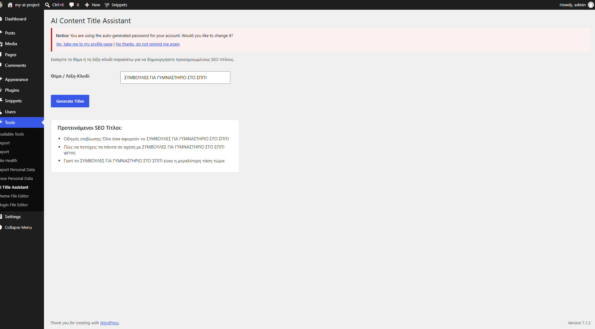

# AI Content Title Assistant - WordPress Plugin

An open-source custom WordPress plugin developed using **Advanced AI Prompt Engineering (Gemini 1.5 Pro)**. This project serves as a production-grade showcase of combining LLM-driven code generation with strict WordPress Core architecture, optimization, and security compliance [wordpress: 3].

## 💡 The Problem & Solution
* **The Problem:** Content managers and WooCommerce store owners spend valuable time brainstorming optimized SEO titles for their posts or products.
* **The Solution:** This plugin adds a clean admin interface within the WordPress Dashboard (under Tools). The user enters a raw topic or seed keyword, and the tool dynamically generates 3 high-converting, localized SEO titles.

## 🛠️ Technical Specifications & Security (WordPress Standards)
Unlike basic AI-generated scripts, this plugin was built by enforcing architectural and security constraints through precise prompting [wordpress: 3]:

* **Secure Form Submission (CSRF Protection):** Implements WordPress Nonces (`wp_create_nonce` and `wp_verify_nonce`) to validate all incoming backend actions and prevent cross-site request forgery.
* **Strict Data Sanitization:** Every user input is parsed and sanitized using `sanitize_text_field` before processing, ensuring no malicious payloads enter the execution thread.
* **Output Escaping (XSS Prevention):** Universal implementation of `esc_html()` and `esc_attr()` on the UI template to eliminate cross-site scripting vulnerabilities.
* **Access Control & Capabilities:** Restricts execution exclusively to users with administrator privileges by validating `manage_options` capabilities.
* **Architecture:** Zero external plugin dependencies. Built for standard local deployment using the native `localhost` router ecosystem [localwp: 2].

---

## 📸 Production Preview

*(Below is the live execution preview within the local environment)*

---

## ⚡ Current State & Future Architecture
* **Current Implementation:** Operating with a structured **Mock Data Engine** inside the local environment to benchmark UI state, execution speed, and validation architecture without API dependencies.
* **Scalability Matrix:** Fully prepared for direct integration with live OpenAI or Google Gemini production endpoints by swapping the mock container with a native `wp_remote_post()` network request infrastructure.

## 🚀 Environment & Deployment
* **Local Development Environment:** LocalWP (WordPress Core) [localwp: 1]
* **Router Routing Mode:** Localhost Configuration [localwp: 2]
* **PHP Compatibility Target:** 8.1+
# wordpress-ai-title-assistant
A custom WordPress plugin built with AI Prompt Engineering that generates SEO titles using WordPress Security Standards.
